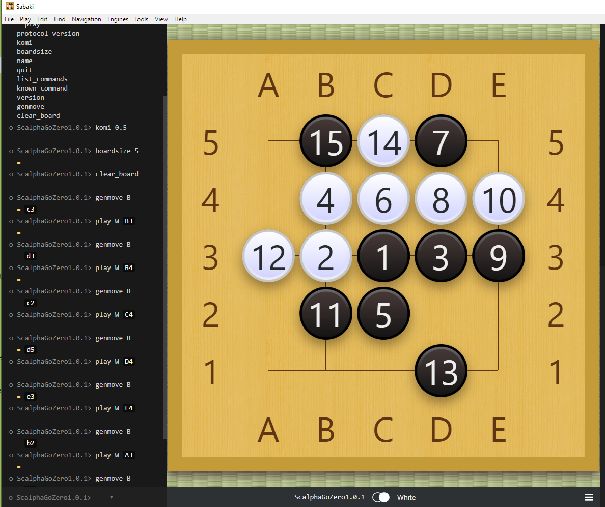

# ScalphaGoZero [](https://travis-ci.org/maxpumperla/ScalphaGoZero)

ScalphaGoZero is an independent implementation of DeepMind's AlphaGo Zero in Scala, 
using [Deeplearning4J (DL4J)](https://deeplearning4j.org/) to run neural networks. 
You can either run experiments with models built in [DL4J directly](https://github.com/maxpumperla/ScalphaGoZero/blob/master/src/main/scala/org/deeplearning4j/scalphagozero/models/DualResnetModel.scala) 
or import prebuilt [Keras models](https://github.com/maxpumperla/ScalphaGoZero/blob/master/src/main/scala/org/deeplearning4j/scalphagozero/models/KerasModel.scala).

ScalphaGoZero is mainly an engineering effort to demonstrate how complex and successful systems
in machine learning are not bound to Python anymore. With access to powerful tools like ND4J for
advanced maths, DL4J for neural networks, and the mature infrastructure of the JVM, languages
like Scala can offer a viable alternative for data scientists. 

This project is a Scala port of the AlphaGo Zero module found in 
[Deep Learning and the Game of Go](https://github.com/maxpumperla/deep_learning_and_the_game_of_go).

## Getting started

To run after cloning, do

```bash
cd ScalphaGoZero
sbt run
```

[This application](https://github.com/maxpumperla/ScalphaGoZero/blob/master/src/main/scala/org/deeplearning4j/scalphagozero/demo/ScalphaGoZero.scala) 
will set up two opponents, simulate some specified number of games between them using the
AlphaGo Zero methodology and train one of the opponents with the experience data
gained from the games. You can also accumulate training experience in a saved model and use that model later.

To use Keras model import you need to generate the resources first:

```bash
cd src/test/python
pip install tensorflow keras
python generate_h5_resources.py
```

The generated, serialized Keras models are put into `src/main/resources` and are picked up
by the `KerasModel` class, as [demonstrated in our tests](https://github.com/maxpumperla/ScalphaGoZero/blob/master/src/test/scala/org/deeplearning4j/scalphagozero/models/TestKerasImport.scala).
 
### GTP Client

It is possible to build a fat executalbe jar that can be used as a GTP client for Go front ends like [Sabaki](https://sabaki.yichuanshen.de/). First run `sbt assembly` to build the fat jar. The engine can be run as
```
java -jar target/scala-2.12/ScalphaGoZero-assembly-1.0.1.jar gtp
```
However, you should use the gtpClient.bat (on Windows) when configuring Sabaki. 
Go to *Engines | Manage Engines* in the top menu, then add a ScalphaGoZero engine as shown here.


Then, from the menu, do *File | New*. 
This allows you to configure a new game and have one or both 
players use the engine that you just added. 
It will attempt to load the model file from the `models` directory based on the board size specified. Currently, there is only a model file for 5x5 games. It is `models/model_size_5_layers_2.model`.



When running, inofrmation and errors are logged to output.log.

## Core Concepts

Quite a few concepts are needed to build an AlphaGoZero system, ScalphaGoZero is intended
as a software developer friendly approach with clean abstractions to help users get 
started. Many of the concepts used here can be reused for other games, only the basics are
really designed for the game of Go. For black, or white, or both, select the ScalphaGoZero engine that you just added and play the game.

- Basics: To let a computer play a game you need to code the basics of the game, including 
what a [Go board](https://github.com/maxpumperla/ScalphaGoZero/blob/master/src/main/scala/org/deeplearning4j/scalphagozero/board/GoBoard.scala),
a [player](https://github.com/maxpumperla/ScalphaGoZero/blob/master/src/main/scala/org/deeplearning4j/scalphagozero/board/Player.scala),
a [move](https://github.com/maxpumperla/ScalphaGoZero/blob/master/src/main/scala/org/deeplearning4j/scalphagozero/board/Move.scala) or 
the current [game state](https://github.com/maxpumperla/ScalphaGoZero/blob/master/src/main/scala/org/deeplearning4j/scalphagozero/board/GameState.scala) is.
Notably, the [Zobrist hashing technique](https://github.com/maxpumperla/ScalphaGoZero/blob/master/src/main/scala/org/deeplearning4j/scalphagozero/board/ZobristHashing.scala)
is implemented in the Go board class to speed up computation. 
- [Encoders](https://github.com/maxpumperla/ScalphaGoZero/blob/master/src/main/scala/org/deeplearning4j/scalphagozero/encoders/Encoder.scala): 
Game states and moves need to be translated into something a neural network can
use for training and predictions, namely tensors. We use [ND4J](https://deeplearning4j.org/docs/latest/nd4j-overview)
for this encoding step. AlphaGo Zero needs a specific [ZeroEncoder](https://github.com/maxpumperla/ScalphaGoZero/blob/master/src/main/scala/org/deeplearning4j/scalphagozero/encoders/ZeroEncoder.scala),
but many other encoders are feasible and can be implemented by the user.
- [Agents](https://github.com/maxpumperla/ScalphaGoZero/blob/master/src/main/scala/org/deeplearning4j/scalphagozero/agents/Agent.scala):
A Go-playing agent knows how to play a game, by selecting the next move, and handles game state information
internally. For AlphaGo Zero you need a [ZeroAgent](https://github.com/maxpumperla/ScalphaGoZero/blob/master/src/main/scala/org/deeplearning4j/scalphagozero/agents/ZeroAgent.scala),
but other agents with simpler methodology can also lead to decent results.
- [Models](https://github.com/maxpumperla/ScalphaGoZero/tree/master/src/main/scala/org/deeplearning4j/scalphagozero/models)
To select a move, agents need machine learning models to predict the value of the current position (value function)
and how well a next move would probably work (policy function). In AlphaGo Zero both of these
components are integrated into one deep neural network, with a so called policy and value head.
We implemented this [model in DL4J here](https://github.com/maxpumperla/ScalphaGoZero/blob/master/src/main/scala/org/deeplearning4j/scalphagozero/models/DualResnetModel.scala).
To start with, you might want to work with simpler models. Each model that takes encoded states and outputs
the right shape can be used within this framework.
- [Scoring](https://github.com/maxpumperla/ScalphaGoZero/tree/master/src/main/scala/org/deeplearning4j/scalphagozero/scoring)
To play actual games, agents need the ability to estimate scores at the end of a game to decide 
who won and reinforce the signals leading to victory (and weaken those leading to defeat). This
includes territory estimation and reporting game results.
- [Experience](https://github.com/maxpumperla/ScalphaGoZero/tree/master/src/main/scala/org/deeplearning4j/scalphagozero/experience):
When opponents play many games against each other, they generate game play data, or experience,
that can be used for training the agents. We use [experience collectors](https://github.com/maxpumperla/ScalphaGoZero/blob/master/src/main/scala/org/deeplearning4j/scalphagozero/experience/ExperienceCollector.scala) 
to store this information.
- [Similation](https://github.com/maxpumperla/ScalphaGoZero/blob/master/src/main/scala/org/deeplearning4j/scalphagozero/simulation/ZeroSimulator.scala):
The last piece needed to run your own AlphaGo Zero is to create a simulation between two `ZeroAgent`
instances. The simulation stores experience data and lets your agents learn from it, so they
become better players over time.

## Contribute

ScalphaGoZero can be improved in many ways, here are a few examples:

- Experience collectors build one large ND4J array, which won't work for large experiments.
This should be refactored into an iterator that only provides you with the next batch
needed for training.
- Test coverage can be vastly improved. The basics are covered, but there are potentially many
edge cases still missing.
- Running a larger experiment and storing the weights somewhere freely accessible to users
would be beneficial to get started and see reasonable results from the start.
- Building a demo with a user interface would be nice. Agents could be wrapped in an HTTP server,
for instance, and connect against a web interface so humans can play their bots.   
